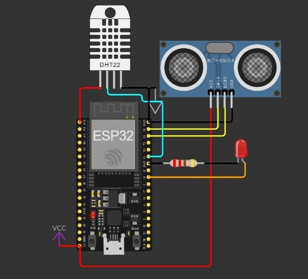
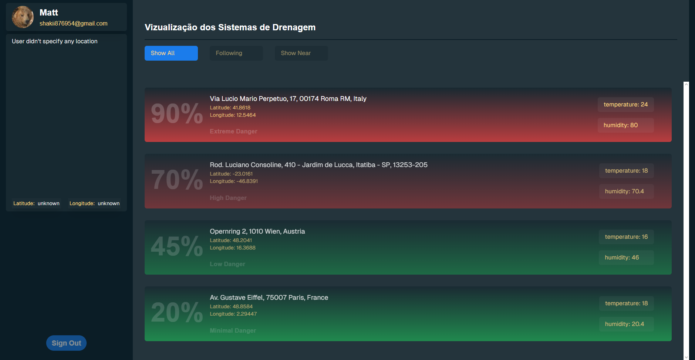
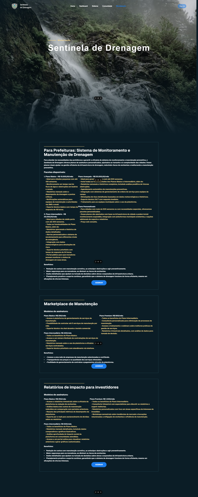

# Sentinela de Drenagem

A crescente urbanização, sem o devido planejamento de infraestrutura, tem gerado problemas graves nas cidades, sendo um dos mais preocupantes as enchentes. A falta de manutenção e a obstrução dos sistemas de drenagem, como bueiros e canais, potencializam os riscos de inundações em áreas urbanas. As chuvas intensas, aliadas a sistemas de drenagem incapazes de suportar o volume de água, resultam em alagamentos que impactam diretamente a vida da população, causando prejuízos materiais, transtornos no trânsito e, em casos mais graves, colocando em risco a segurança e saúde das pessoas.

A **Sentinela de Drenagem** surge como uma solução inovadora para este problema. Ao implementar sensores IoT (Internet das Coisas) em pontos estratégicos da drenagem urbana, o sistema monitora continuamente o fluxo de água e detecta obstruções antes que estas possam causar danos significativos. Quando um entupimento é identificado ou há sinais de risco iminente de enchente, alertas automáticos são enviados para as equipes de manutenção e moradores da região afetada. Com isso, é possível agir de maneira preventiva, garantindo uma resposta rápida e eficiente antes que a situação se agrave. Além disso, o sistema armazena dados históricos e gera relatórios que auxiliam na análise preditiva, permitindo que futuras obstruções sejam evitadas por meio de manutenções planejadas.

## Objetivo do Projeto e sua Relevância no Contexto Urbano

O objetivo principal do projeto **Sentinela de Drenagem** é desenvolver uma solução tecnológica que utilize dispositivos IoT para monitorar os sistemas de drenagem em áreas urbanas, prevenindo enchentes e minimizando seus impactos. O projeto visa criar uma plataforma integrada que permita o acompanhamento em tempo real do fluxo de água em bueiros e canais, gerando alertas automáticos em caso de obstruções ou funcionamento anormal.

A relevância deste projeto no contexto urbano é inegável. As enchentes são um problema recorrente nas grandes cidades, especialmente em períodos de chuvas intensas. Muitas vezes, a falta de um sistema eficiente de manutenção e monitoramento agrava a situação, levando a prejuízos econômicos e transtornos para os moradores. A implementação de um sistema como o **Sentinela de Drenagem** não só protege a população, mas também contribui para a eficiência da gestão pública, otimizando os processos de manutenção e reduzindo custos com obras emergenciais e reparos. Além disso, a plataforma traz benefícios ao possibilitar a tomada de decisões mais precisas com base em dados históricos e preditivos, o que pode auxiliar no planejamento urbano a longo prazo, prevenindo crises e melhorando a qualidade de vida nas cidades.

## O Dispositivo IoT

O coração do sistema **Sentinela de Drenagem** é um dispositivo IoT robusto e eficiente, projetado para monitorar o nível da água e as condições climáticas em tempo real. A seguir, detalhamos os componentes e a arquitetura técnica que compõem este dispositivo:

### Componentes Utilizados:
- **Microcontrolador ESP32**: O ESP32 é responsável por todo o processamento e comunicação do dispositivo. Ele gerencia a leitura dos sensores, processa os dados coletados e envia essas informações via Wi-Fi para o servidor de monitoramento. O ESP32 foi escolhido por sua alta capacidade de processamento, baixo consumo de energia e integração nativa com redes Wi-Fi, o que o torna ideal para aplicações IoT.
- **Sensor Ultrassônico HC-SR04**: Este sensor é utilizado para medir o nível da água em bueiros e canais de drenagem. Ele funciona emitindo ondas ultrassônicas que são refletidas pela superfície da água, calculando a distância com base no tempo que o som leva para retornar. Esses dados são fundamentais para detectar mudanças no nível de água que possam indicar entupimentos ou bloqueios.
- **Sensor de Umidade e Temperatura DHT22**: O DHT22 é responsável por monitorar as condições climáticas do ambiente, como temperatura e umidade. Esses dados complementam as informações de nível de água, oferecendo uma visão mais completa das condições que podem influenciar o sistema de drenagem.
- **LED Indicador**: O dispositivo também inclui um LED que serve como indicador visual. O LED pode piscar ou mudar de cor para indicar diferentes estados, como normalidade, alerta ou erro de comunicação.
- **Fonte de Alimentação**: O dispositivo é alimentado por uma fonte externa, garantindo que ele opere de forma contínua e estável, mesmo em ambientes hostis e com variações climáticas.

### Funcionamento Técnico:
O microcontrolador ESP32 lê os dados tanto do sensor HC-SR04 quanto do DHT22 de forma contínua. Utilizando a conectividade Wi-Fi, ele envia essas informações para o servidor, onde os dados são processados e exibidos na plataforma de monitoramento. O código do ESP32 foi desenvolvido em C++, utilizando o framework Arduino, devido à sua simplicidade e ampla compatibilidade com dispositivos IoT. A plataforma **PlatformIO**, integrada ao Visual Studio Code, foi utilizada como ambiente de desenvolvimento para programar e depurar o microcontrolador, otimizando o processo de criação e implementação do código.

> Confira o código completo sobre o dispositivo IoT no [repositório oficial](https://github.com/TrojanMinds/sentinela-drenagem-iot).

## Protótipo do Projeto (Wokwi)

O simulador Wokwi foi utilizado para desenvolver e testar o protótipo do dispositivo IoT, garantindo que todos os componentes funcionem corretamente antes da implementação física.

## Plataforma

[Clique aqui para visualizar a versão desktop online.](https://sentinela-drenagem-web.vercel.app/) 

A plataforma do **Sentinela de Drenagem** é a interface central que conecta todos os dispositivos IoT distribuídos pela cidade e oferece uma solução robusta para monitoramento, análise e gestão das condições de drenagem urbana. Abaixo estão descritas as principais funcionalidades da plataforma, divididas em categorias que abrangem desde o monitoramento em tempo real até a gestão de manutenção e comunicação com a comunidade.

### Monitoramento em Tempo Real

A principal função da plataforma é monitorar, em tempo real, as condições dos sistemas de drenagem urbana por meio dos dados enviados pelos dispositivos IoT. Isso inclui:

- **Nível de água**: O sistema exibe informações detalhadas sobre o nível da água em bueiros e canais, utilizando os dados do sensor ultrassônico HC-SR04. Qualquer elevação ou queda fora do normal é detectada imediatamente, permitindo a identificação de possíveis obstruções ou falhas no sistema de drenagem.
  
- **Temperatura e umidade**: Com o auxílio dos sensores DHT22, a plataforma exibe a temperatura ambiente e os níveis de umidade, ajudando a prever condições que podem agravar enchentes ou deteriorar a infraestrutura.

- **Mapas interativos**: A plataforma oferece um mapa interativo da cidade, com ícones que representam cada sensor instalado. As áreas monitoradas são coloridas de acordo com seu status: verde para funcionamento normal, amarelo para alerta, e vermelho para risco crítico de obstrução ou enchente.

- **Gráficos e indicadores**: Para facilitar a visualização, o sistema conta com gráficos de desempenho em tempo real e indicadores de status que oferecem uma visão geral da rede de drenagem e suas condições.

### Sistema de Alertas e Notificações

O sistema de alertas é uma parte essencial da plataforma, pois permite a notificação rápida e eficiente tanto das equipes de manutenção quanto da comunidade afetada. Entre suas funcionalidades, destacam-se:

- **Alertas automáticos**: Sempre que um sensor detectar um risco, como o aumento anormal do nível da água ou uma mudança brusca nas condições meteorológicas, a plataforma envia alertas automáticos por diferentes meios, como SMS, email e notificações de aplicativos.
  
- **Alertas personalizados**: Usuários, como comerciantes ou moradores, podem configurar a plataforma para monitorar áreas específicas da cidade e receber alertas apenas dessas regiões, garantindo uma comunicação mais eficaz e menos invasiva.

- **Escalonamento de alertas**: Diferentes níveis de alerta são emitidos com base na gravidade da situação. Manutenções preventivas, por exemplo, geram alertas direcionados a equipes de campo, enquanto situações críticas, como risco de enchente, são comunicadas a autoridades e à população em geral.

### Relatórios e Histórico de Dados

A plataforma não só permite o monitoramento em tempo real, mas também oferece ferramentas robustas para análise e tomada de decisão com base em dados históricos. Entre essas ferramentas estão:

- **Armazenamento de dados históricos**: Todos os dados enviados pelos sensores são armazenados para fins de análise. Isso permite que as equipes de gestão avaliem o desempenho dos sistemas de drenagem ao longo do tempo e identifiquem padrões de obstrução.

- **Relatórios gerenciais**: A plataforma gera relatórios automáticos que detalham a eficiência do sistema de drenagem, indicando áreas que precisam de manutenção urgente ou que apresentam maior risco de entupimento. Esses relatórios são fundamentais para o planejamento de obras preventivas e investimentos em infraestrutura.

- **Análise preditiva**: Utilizando algoritmos de análise de dados, a plataforma pode prever áreas com maior probabilidade de sofrer entupimentos, permitindo que ações preventivas sejam tomadas antes que o problema ocorra.

### Sistema de Manutenção Preditiva

A manutenção proativa é uma parte crucial do **Sentinela de Drenagem**, garantindo que a infraestrutura de drenagem urbana seja mantida de forma eficaz e o risco de enchentes seja minimizado. As funcionalidades relacionadas à manutenção incluem:

- **Agendamento automático de manutenção**: Com base nos dados coletados dos sensores, a plataforma pode recomendar ou até mesmo agendar manutenções preventivas para bueiros e canais que apresentam sinais de obstrução iminente.

- **Integração com equipes de campo**: A plataforma pode se conectar a sistemas de gerenciamento de ordens de serviço, gerando automaticamente solicitações de manutenção e enviando-as diretamente às equipes de campo responsáveis pela execução do serviço.

- **Priorização de ações**: Através da análise de dados, a plataforma classifica os locais que necessitam de manutenção, permitindo que as equipes priorizem áreas críticas, onde o risco de enchentes é maior.

### Modelos Previsionais e Integração com Dados Meteorológicos

Outra funcionalidade avançada da plataforma é sua capacidade de integrar dados meteorológicos e gerar previsões detalhadas sobre o comportamento da rede de drenagem em diferentes cenários climáticos. Isso inclui:

- **Integração com dados meteorológicos**: A plataforma está conectada a sistemas de previsão do tempo, correlacionando informações sobre chuvas intensas com o fluxo de água detectado nos bueiros. Isso permite que a plataforma antecipe problemas antes que ocorram.

- **Simulações de cenários de risco**: Utilizando previsões meteorológicas e dados históricos, a plataforma é capaz de simular cenários de risco, sugerindo medidas preventivas para mitigar enchentes antes de grandes eventos climáticos.

### Módulo de Monetização e Sustentabilidade

Para garantir a sustentabilidade financeira do projeto, a plataforma oferece diferentes modelos de monetização e parcerias com prefeituras e empresas de manutenção urbana. Entre as opções estão:

- **Modelos de assinatura para prefeituras**: A plataforma pode ser oferecida a prefeituras em diferentes pacotes, permitindo monitoramento e manutenção preventiva escaláveis, de acordo com o tamanho e as necessidades da cidade.

- **Marketplace de serviços de manutenção**: A plataforma facilita a contratação de empresas parceiras para a execução de serviços de manutenção, oferecendo um canal direto entre prefeituras e prestadores de serviço.

- **Relatórios para investidores**: Para demonstrar o impacto do sistema, a plataforma gera relatórios detalhados que mostram a redução no número de enchentes e os custos evitados, tornando o projeto atrativo para investidores interessados no retorno financeiro e no impacto social positivo.

## Escalabilidade

A escalabilidade é uma característica central do **Sentinela de Drenagem**, permitindo que a solução seja aplicada em diferentes contextos urbanos, desde pequenas cidades até grandes metrópoles, sem comprometer seu desempenho ou eficiência. Essa capacidade de adaptação é garantida por diversas estratégias de design e arquitetura do sistema, tanto no dispositivo IoT quanto na plataforma digital.

### Infraestrutura Modular

A solução foi projetada de forma modular, o que permite que componentes e funcionalidades sejam adicionados ou removidos conforme a necessidade do ambiente onde está sendo implementado. Essa abordagem garante que a plataforma possa atender às demandas de diferentes regiões com infraestrutura e recursos variados. Por exemplo:

- **Número de sensores**: Em cidades pequenas, pode ser suficiente monitorar apenas as áreas mais críticas, enquanto em grandes centros urbanos é possível escalar o número de dispositivos IoT para centenas ou até milhares, cobrindo toda a rede de drenagem.

- **Zonas de monitoramento**: A plataforma permite configurar diferentes zonas de monitoramento, permitindo que áreas geográficas sejam divididas e gerenciadas de forma independente. Isso é particularmente útil em cidades grandes, onde diferentes distritos podem ter suas próprias equipes de manutenção e prioridades de infraestrutura.

### Suporte à Integração de Novas Tecnologias

O projeto também foi concebido para integrar novas tecnologias conforme elas se tornam disponíveis, garantindo que a solução permaneça atualizada e continue a escalar conforme novas demandas surgem. Isso inclui:

- **Suporte a novos sensores**: A plataforma foi projetada de forma modular, permitindo a fácil integração de novos tipos de sensores no futuro, como sensores de qualidade da água, câmeras de monitoramento e outros dispositivos que possam melhorar o diagnóstico e a prevenção de enchentes.

- **Atualizações de software**: A arquitetura do sistema suporta atualizações contínuas, garantindo que a plataforma possa evoluir sem interrupções no serviço. Isso permite que a solução se mantenha competitiva e continue a atender às necessidades crescentes de diferentes cidades e regiões.

Em resumo, a escalabilidade do **Sentinela de Drenagem** é um de seus principais diferenciais, garantindo que a solução possa ser implantada em diferentes contextos urbanos, crescer com a demanda e continuar oferecendo uma experiência de alta performance, independentemente do número de sensores ou da complexidade da rede de drenagem monitorada.

# O time

## Henrique

💻Desenvolvedor Web e C/C++    
📧 henriquemelo0983@gmail.com   
💼 LinkedIn: [Henrique Melo](https://www.linkedin.com/in/henrique-de-oliveira-melo-933a41203/)   
🐈‍⬛ GitHub: [HenriqueMelo2007](https://github.com/HenriqueMelo2007)   

## Matheus

🖥️Desenvolvedor Fullstack  
📧 shakii876954@gmail.com   
💼 LinkedIn: [Matheus](https://www.linkedin.com/in/mateus-a-o-87877226a/)    
🐈‍⬛ GitHub: [Pechino](https://github.com/Pechino)   

## Gisele

🎨Designer  
📧 gisele.ramos.ismart@gmail.com  
💼 LinkedIn: [Gisele Ramos](https://www.linkedin.com/in/gisele-ramos-98429a289/)   
🐈‍⬛ GitHub: [MatthTsxo](https://github.com/MatthTsxo)   

## Maitê

🌐Comunicação e inovação em tecnologia   
📧 maite.nascimento.ismart@gmail.com  
💼 LinkedIn: [Maitê Silva](https://www.linkedin.com/in/maite-silva?utm_source=share&utm_campaign=share_via&utm_content=profile&utm_medium=android_app)  
🐈‍⬛ GitHub: [maite-silva](https://github.com/maite-silva)